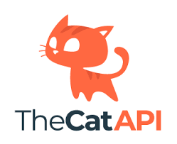
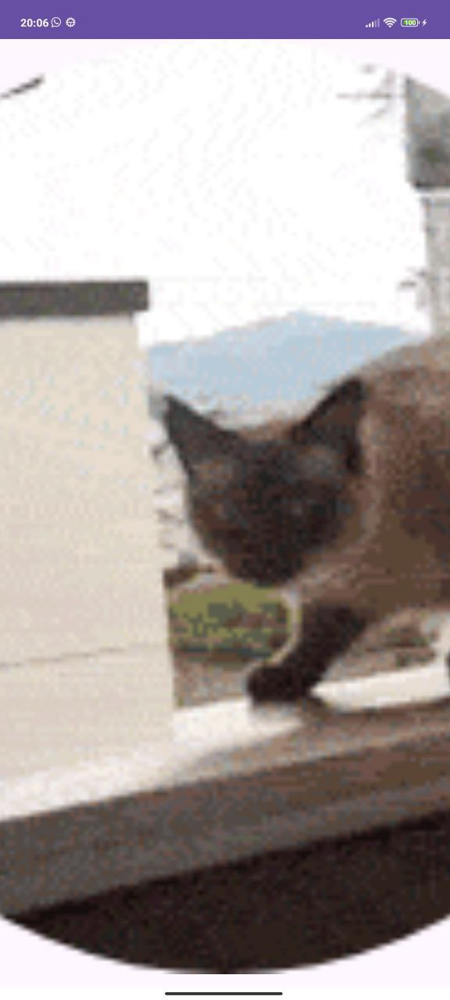
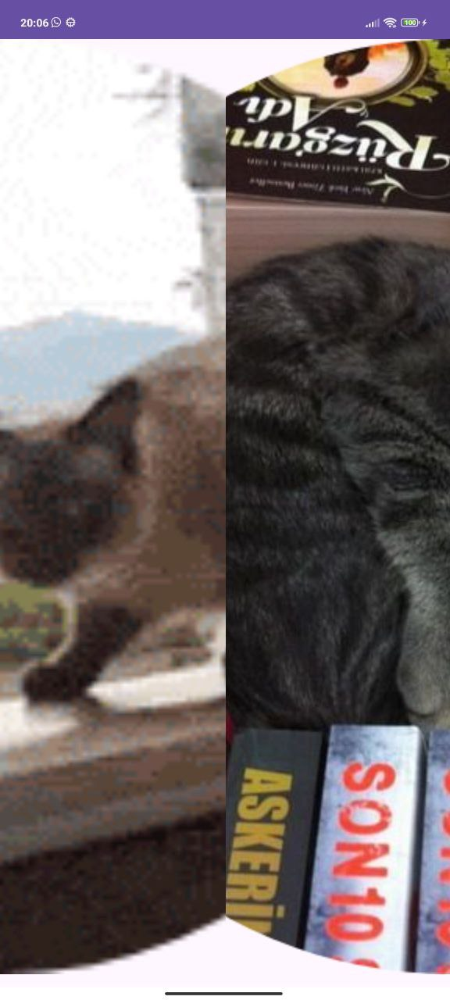
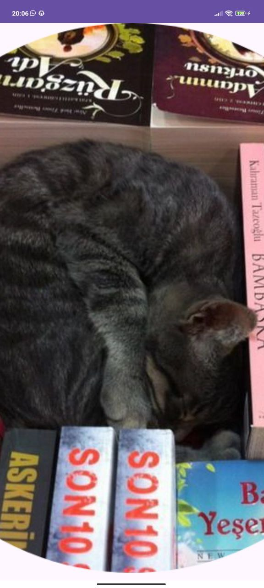

# The Cat API Wallpapers

## О проекте
The Cat API Wallpapers - это приложение для Android, которое предоставляет случайные фотографии котов для использования в качестве обоев на вашем устройстве.

## Особенности
- Получение случайных изображений котов с использованием The Cat API
- Использование библиотеки ViewPager2 для удобного перелистывания изображений
- Индикатор страниц для отслеживания текущей страницы и перехода к следующим изображениям
- Загрузка новых изображений при достижении конца списка

## Технологии
- Kotlin
- Retrofit для взаимодействия с The Cat API
- Coil для загрузки изображений
- Shimmer для добавления эффекта загрузки
- ViewPager2 для перелистывания изображений

## Инструкции по установке
1. Склонируйте репозиторий на свое устройство.
2. Откройте проект в Android Studio.
3. Запустите приложение на эмуляторе или физическом устройстве.

## Снимки экрана

## Лицензия
MIT License

Copyright (c) [16.01.2024] [Yusuf]

Получение копии этого программного обеспечения и связанных файлов
("Программное обеспечение"), а также использование исходного и объектного кода,
предоставляются бесплатно, безвозмездно и без ограничений лицензии, включая,
но не ограничиваясь правами на использование, копирование, изменение, объединение,
публикацию, распространение, сублицензирование и/или продажу копий Программного обеспечения,
а также лицам, которым предоставляется данное программное обеспечение, при соблюдении
условий следующей лицензии:

Вышеупомянутое уведомление об авторском праве и это уведомление о разрешении должны быть
включены во все копии или значимые части Программного обеспечения.

ПРОГРАММНОЕ ОБЕСПЕЧЕНИЕ ПРЕДОСТАВЛЯЕТСЯ "КАК ЕСТЬ", БЕЗ КАКИХ-ЛИБО
ГАРАНТИЙ, ЯВНЫХ ИЛИ ПОДРАЗУМЕВАЕМЫХ, ВКЛЮЧАЯ, НО НЕ ОГРАНИЧИВАЯСЬ, ГАРАНТИЙ
ТОВАРНОГО СОСТОЯНИЯ, ПРИГОДНОСТИ ДЛЯ ОПРЕДЕЛЕННОЙ ЦЕЛИ И НЕНАРУШЕНИЯ.
НИ ПРИ КАКИХ ОБСТОЯТЕЛЬСТВАХ АВТОРЫ ИЛИ ДЕТИ АВТОРОВ НЕ НЕСУТ ОТВЕТСТВЕННОСТИ
ПО ДОГОВОРНОЙ, ДЕЛИКТНОЙ ИЛИ ИНОЙ ОТВЕТСТВЕННОСТИ, БУДЬ-ТО В РАМКАХ ДОГОВОРА,
ДЕЛА ИЛИ ИНАЧЕ, ВОЗНИКАЮЩЕЙ ИЗ, ИЛИ В СВЯЗИ С ПРОГРАММНЫМ ОБЕСПЕЧЕНИЕМ ИЛИ
ИСПОЛЬЗОВАНИЕМ ИЛИ ДЕЙСТВИЯМИ СО СТОРОНЫ ПРОГРАММНОГО ОБЕСПЕЧЕНИЯ.
